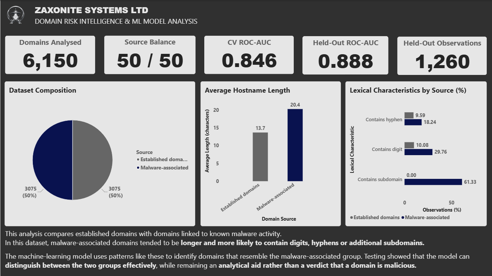
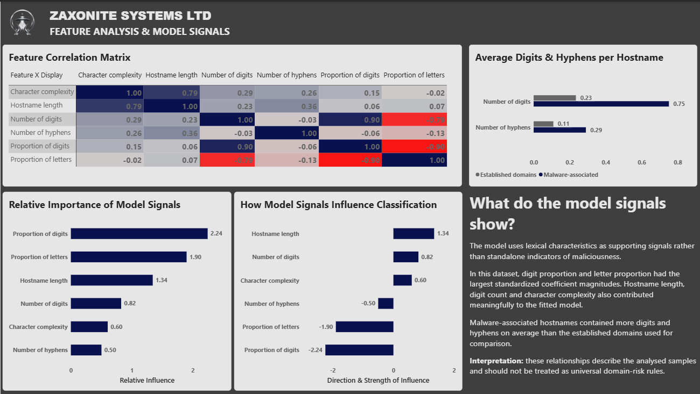
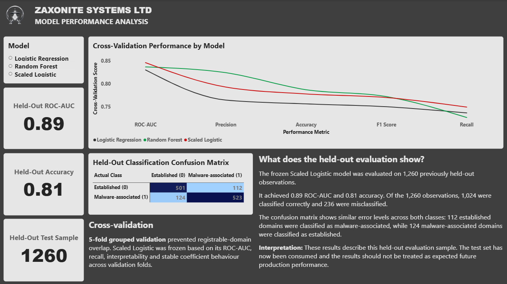

# Zaxonite Domain Risk ML

A reproducible machine-learning and data-analysis project investigating lexical characteristics associated with malware-linked and established domain names.

The project combines Python data preparation, feature engineering, exploratory analysis, leakage-controlled machine-learning evaluation, reproducible reporting outputs and a six-page Power BI dashboard. It compares hostname observations derived from URLhaus threat-intelligence data with established domains from the Tranco ranking to investigate whether hostname structure contains useful discriminatory signal.

The frozen v0.1 candidate is an interpretable scaled logistic-regression classifier. Its output represents a URLhaus-class probability within this dataset and modelling framework. It must not be interpreted as the probability that an arbitrary domain is malicious.

## Project Status

**Version:** v0.1 candidate
**Status:** Frozen and evaluated
**Model:** Scaled Logistic Regression
**Model features:** 6
**Prepared observations:** 6,150
**Development observations:** 4,890
**Held-out test observations:** 1,260
**Power BI report:** 6-page Domain Risk Analysis dashboard

The held-out test set has been used for the completed v0.1 final evaluation and is therefore no longer considered untouched. Further model selection or tuning must not be performed against this test set.

## Methodology

### Data Sources

The v0.1 dataset combines two public sources:

- **URLhaus** — hostnames extracted from malware-associated URL observations.
- **Tranco** — established domains drawn from the Tranco top-domain ranking.

The prepared baseline contains 6,150 observations, balanced equally between 3,075 URLhaus observations and 3,075 Tranco observations.

### Leakage Control

Multiple hostnames can belong to the same registrable domain. A random row-level split could therefore place closely related observations into both development and test data and produce overly optimistic performance estimates.

To reduce this risk, observations are grouped by `registrable_domain` and separated using a group-aware split.

The resulting partitions contain:

- **Development set:** 4,890 observations
- **Held-out test set:** 1,260 observations
- **Registrable-domain overlap:** 0

Model comparison within the development partition uses five-fold `StratifiedGroupKFold` cross-validation.

### Frozen Model Features

The v0.1 candidate uses six lexical hostname features:

- `hostname_length`
- `digit_count`
- `digit_ratio`
- `hyphen_count`
- `hostname_entropy`
- `alphabetic_ratio`

`subdomain_depth` was investigated but deliberately excluded from model training. In the prepared dataset, subdomains occur in 61.33% of URLhaus observations and 0.00% of Tranco observations. This strong source-specific difference creates a substantial confounding risk and could allow the model to learn dataset construction characteristics rather than a more generalisable hostname signal.

## Model Evaluation

Three candidate approaches were compared using five-fold group-aware cross-validation on the development partition.

| Model | Accuracy | Precision | Recall | F1 | ROC-AUC |
|---|---:|---:|---:|---:|---:|
| Logistic Regression | 0.7562 | 0.7645 | 0.7364 | 0.7500 | 0.8304 |
| Random Forest | 0.7871 | 0.8244 | 0.7265 | 0.7722 | 0.8370 |
| Scaled Logistic | 0.7779 | 0.7929 | 0.7492 | 0.7701 | 0.8464 |

The scaled logistic model was frozen as the v0.1 candidate. Selection considered discrimination, recall, interpretability and coefficient stability rather than choosing a model from a single metric alone.

### Completed Held-Out Evaluation

After model selection was frozen, the candidate was evaluated against the 1,260-observation held-out test partition.

| Metric | Result |
|---|---:|
| Accuracy | 0.812698 |
| Precision | 0.823622 |
| Recall | 0.808346 |
| F1 | 0.815913 |
| ROC-AUC | 0.888246 |

The confusion matrix contained 501 correctly classified Tranco observations, 523 correctly classified URLhaus observations, 112 Tranco observations classified as URLhaus, and 124 URLhaus observations classified as Tranco.

These results describe performance on this specific completed evaluation. The held-out partition has now been consumed and the results must not be treated as an estimate guaranteed to reproduce on future or operational domain populations.

## Power BI Analysis Dashboard

The project includes a six-page Power BI report built from the reproducible reporting datasets generated by the Python analysis pipeline.

The dashboard translates the modelling work into an analyst-facing report covering:

- **Scope & Glossary** - analysis boundaries, dataset scope and interpretation of key metrics.
- **Domain Risk Overview** - dataset composition, headline lexical differences and model performance indicators.
- **Domain Intelligence** - comparison of hostname length, entropy, digits, hyphens and subdomain characteristics.
- **Feature Analysis** - feature correlations, model signals and standardized logistic-regression coefficients.
- **Model Performance** - cross-validation comparison, held-out evaluation metrics and classification confusion matrix.
- **Model Governance** - data provenance, leakage controls, model boundaries, limitations and requirements for future validation.

The Power BI report is available at:

`powerbi/Zaxonite_Domain_Risk_Analysis_v0_1.pbix`

### Dashboard Preview

#### Domain Risk Overview



#### Feature Analysis



#### Model Performance



The dashboard is intended to demonstrate the complete analytical workflow from data preparation and exploratory analysis through model evaluation, reporting and governance. It preserves the same model boundary as the underlying Python project: model output is supporting analytical evidence and not an automated malicious-domain verdict.

## Inference

The frozen candidate can score a syntactically valid hostname from the command line:

```powershell
python -m src.predict_domain example.com
```

## Limitations

The v0.1 model has several important limitations:

- The dataset represents two specific sources and collection contexts: URLhaus and Tranco. Their distributions are not equivalent to the complete populations of malicious and benign domains.
- The negative class consists of established Tranco domains. An established-domain sample should not be interpreted as proof that every observation is benign.
- URLhaus observations represent malware-associated URL infrastructure and should not be treated as a complete representation of all malicious-domain behaviour.
- The classifier uses lexical hostname features only. It does not inspect page content, DNS reputation, certificate history, registration records, network infrastructure, redirects, payloads, or behavioural telemetry.
- Dataset-source artefacts can create misleading predictive signal. `subdomain_depth` was excluded for this reason after a strong source-specific difference was identified.
- Several engineered features are correlated. Individual logistic-regression coefficients therefore describe conditional relationships within the fitted model and must not be interpreted as standalone causal risk factors.
- The model has not been independently validated on a later temporal dataset or a separately collected operational domain population.
- The completed v0.1 held-out test set has been consumed. Future model development requires new independent evaluation data.
- Model probabilities are class scores within this modelling framework and are not calibrated estimates of real-world maliciousness.

For these reasons, model output should be treated as supporting evidence for further investigation rather than an automated security verdict.

## Reproducibility

The project separates data preparation, feature engineering, dataset splitting, model training, evaluation, inference, exploratory analysis, and reporting into reproducible Python modules.

### Run the Test Suite

From the project root with the virtual environment active:

```powershell
python -m pytest -q
```

The current regression suite contains 29 tests covering feature engineering, group-aware splitting, model configuration, model persistence, inference behaviour, and input-boundary validation.

### Generate Analysis and Reporting Outputs

The complete EDA and reporting workflow can be regenerated with:

```powershell
python -m analysis.eda
```

This produces:

- nine analytical and model-evaluation figures in `reports/figures/`;
- eight structured reporting datasets in `reports/data/`.

The reporting datasets are designed to support reproducible downstream visualisation, including the project's Power BI analytical dashboard.

## Installation

The v0.1 project was developed and evaluated using **Python 3.12.10**.

Clone the repository and create a virtual environment:

```powershell
python -m venv venv
```

Activate the environment on Windows PowerShell:

```powershell
.\venv\Scripts\Activate.ps1
```

Install the pinned direct dependencies:

```powershell
python -m pip install -r requirements.txt
```

The dependency versions in `requirements.txt` correspond to the direct package versions used for the frozen v0.1 development and evaluation environment.

After installation, verify the project with:

```powershell
python -m pytest -q
```

## Project Structure

```text

domain_ml_model/
|-- analysis/
|   `-- eda.py
|-- data/
|   |-- processed/
|   `-- raw/
|-- docs/
|   |-- BUILD_LOG.md
|   |-- DATASET_PROVENANCE.md
|   `-- MODEL_SCOPE.md
|-- models/
|   |-- scaled_logistic_v0_1.joblib
|   `-- scaled_logistic_v0_1_metadata.json
|-- powerbi/
|   `-- Zaxonite_Domain_Risk_Analysis_v0_1.pbix
|-- reports/
|   |-- data/
|   `-- figures/
|-- src/
|   |-- build_features.py
|   |-- download_data.py
|   |-- evaluate_candidate.py
|   |-- features.py
|   |-- predict_domain.py
|   |-- prepare_data.py
|   |-- split_data.py
|   `-- train_baseline.py
|-- tests/
|   `-- test_features.py
|-- .env.example
|-- .gitignore
|-- README.md
`-- requirements.txt

```

The project separates the ML lifecycle into explicit stages:

- `src/` contains data preparation, feature engineering, splitting, training, evaluation and inference code.
- `analysis/` contains reproducible exploratory analysis and reporting generation.
- `docs/` contains provenance, scope and development records.
- `models/` contains the frozen v0.1 model artifact.
- `powerbi/` contains the six-page Domain Risk Analysis dashboard.
- `reports/figures/` contains generated analytical visualisations.
- `reports/data/` contains tidy reporting datasets intended for downstream analysis and Power BI.
- `tests/` contains the automated regression suite.
